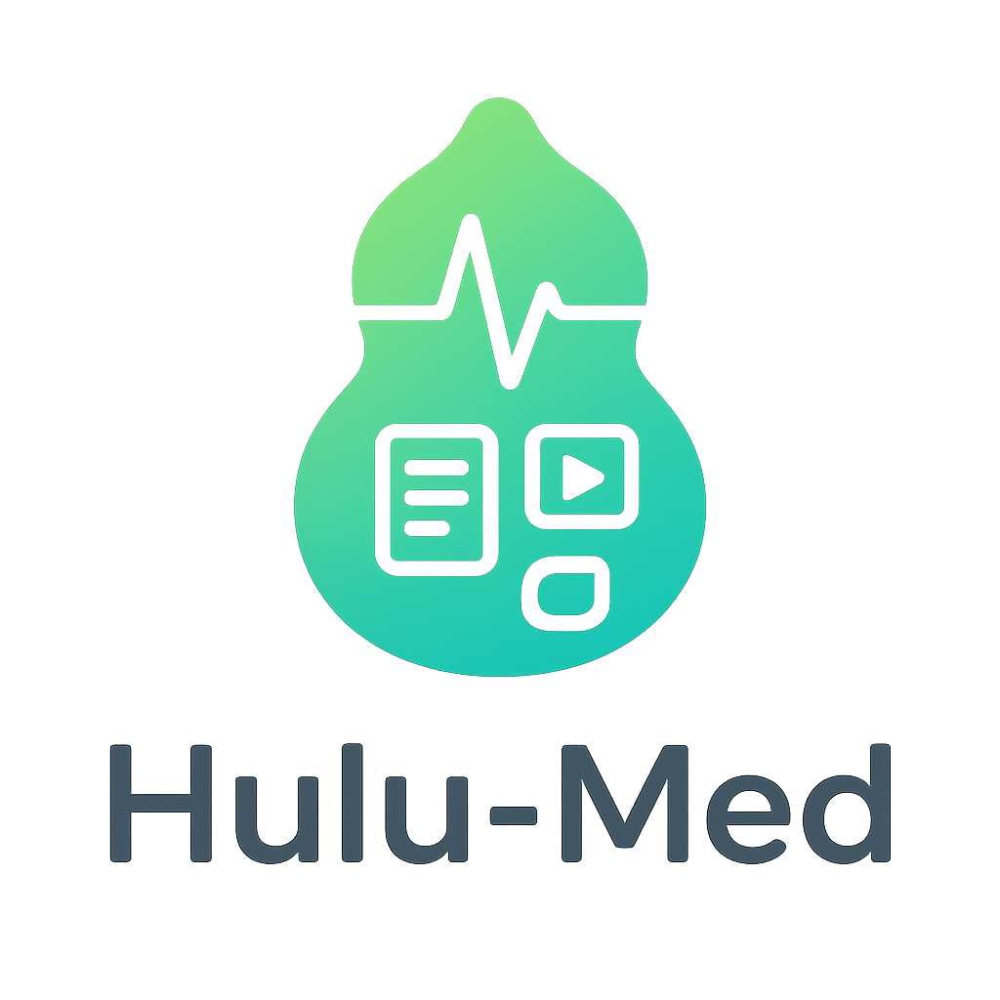

<h1 style="display: flex; align-items: center; justify-content: center; text-align: left;">
  
  <span>Hulu-Med: A Transparent Generalist Model towards Holistic Medical Vision-Language Understanding</span>
</h1>
<div align="center">

[](https://arxiv.org/abs/xxxx.xxxxx)
[](https://huggingface.co/ZJU-AI4H/Hulu-Med)
[](https://modelscope.cn/models/Med-Team/Hulu-Med)
[](LICENSE)

[📄 Paper](https://arxiv.org/abs/xxxx.xxxxx) | [🤗 Hulu-Med-7B](https://huggingface.co/ZJU-AI4H/Hulu-Med-7B) |[🤗 Hulu-Med-14B](https://huggingface.co/ZJU-AI4H/Hulu-Med-14B) |[🤗 Hulu-Med-32B](https://huggingface.co/ZJU-AI4H/Hulu-Med-32B) | [🔮 ModelScope Models](https://modelscope.cn/models/Med-Team/Hulu-Med) | [📊 Demo](#demo)

</div>

## 🔥 News

- **[2025-10-08]** Hulu-Med models and inference code released!

## 📖 Overview

**Hulu-Med** is a transparent medical vision-language model that unifies understanding across diverse modalities including **medical text, 2D/3D images, and videos**. Built with a focus on transparency and accessibility, Hulu-Med achieves state-of-the-art performance on 30 medical benchmarks while being trained entirely on public data.

<div align="center">

</div>

### Key Features

- 🌟 **Holistic Multimodal Understanding**: Seamlessly processes medical text, 2D images, 3D volumes, and surgical videos
- 🔓 **Fully Transparent**: Complete open-source pipeline including data curation, training code, and model weights
- 📊 **State-of-the-Art Performance**: Outperforms leading open-source models and competes with proprietary systems
- ⚡ **Efficient Training**: Only 4,000-40,000 GPU hours required for 7B-32B variants
- 🗂️ **Comprehensive Coverage**: Trained on 16.7M samples spanning 12 anatomical systems and 14 imaging modalities

### Comprehensive Data Coverage

Our training corpus encompasses:

- **12 Major Anatomical Systems**: Multi-System, Skin/Integumentary, Respiratory, Cellular/Tissue Level, Digestive, Nervous, Cardiovascular, Musculoskeletal, Reproductive, Urinary, Whole Body, Endocrine, Immune/Lymphatic, and Hematologic systems
- **14 Medical Imaging Modalities**: CT, MRI, X-Ray, Ultrasound, PET, OCT, Endoscopy, Microscopy, Histopathology, Fundus, Dermoscopy, Angiography, Digital Photograph, and Medical Chart
- **Diverse Downstream Tasks**: Medical Dialogue, Anomaly Detection, Prognosis Prediction, Treatment Planning, Surgical Skill Assessment, Education, Medical Report Generation, Surgical Phase Recognition, Medical Computation, and more

## 🏆 Performance Highlights

### Medical Multimodal Benchmarks

Performance comparison on medical multimodal benchmarks (For the 'Medical VLM < 10B' subgroup, **bold** indicates the best method):

| Models | OM.VQA | PMC-VQA | VQA-RAD | SLAKE | PathVQA | MedXQA | MMMU-Med |
|--------|--------|---------|---------|-------|---------|--------|----------|
| **Proprietary Models** |
| GPT-4.1 | 75.5 | 55.2 | 65.0 | 72.2 | 55.5 | 45.2 | 75.2 |
| GPT-4o | 67.5 | 49.7 | 61.0 | 71.2 | 55.5 | 44.3 | 62.8 |
| Claude Sonnet 4 | 65.5 | 54.4 | 67.6 | 70.6 | 54.2 | 43.3 | 74.6 |
| Gemini-2.5-Flash | 71.0 | 55.4 | 68.5 | 75.8 | 55.4 | 52.8 | 76.9 |
| **General VLMs (< 10B)** |
| Qwen2.5VL-7B | 63.6 | 51.9 | 63.2 | 66.8 | 44.1 | 20.1 | 50.6 |
| InternVL2.5-8B | 81.3 | 51.3 | 59.4 | 69.0 | 42.1 | 21.7 | 53.5 |
| InternVL3-8B | 79.1 | 53.8 | 65.4 | 72.8 | 48.6 | 22.4 | 59.2 |
| **General VLMs (> 10B)** |
| InternVL3-14B | 78.9 | 54.1 | 66.3 | 72.8 | 48.0 | 23.1 | 63.1 |
| Qwen2.5V-32B | 68.2 | 54.5 | 71.8 | 71.2 | 41.9 | 25.2 | 59.6 |
| InternVL3-38B | 79.8 | 56.6 | 65.4 | 72.7 | 51.0 | 25.2 | 65.2 |
| **Medical VLMs (< 10B)** |
| LLaVA-Med-7B | 34.8 | 22.7 | 46.6 | 51.9 | 35.2 | 20.8 | 28.1 |
| MedGemma-4B | 70.7 | 49.2 | 72.3 | 78.2 | 48.1 | 25.4 | 43.2 |
| HuatuoGPT-V-7B | 74.3 | 53.1 | 67.6 | 68.1 | 44.8 | 23.2 | 49.8 |
| Lingshu-7B | 82.9 | 56.3 | 67.9 | 83.1 | 61.9 | 26.7 | - |
| **Hulu-Med-7B** | **84.2** | **66.8** | **78.0** | **86.8** | **65.6** | **29.0** | **51.4** |
| **Medical VLMs (> 10B)** |
| HealthGPT-14B | 75.2 | 56.4 | 65.0 | 66.1 | 56.7 | 24.7 | 49.6 |
| HuatuoGPT-V-34B | 74.0 | 56.6 | 61.4 | 69.5 | 44.4 | 22.1 | 51.8 |
| Lingshu-32B | 83.4 | 57.9 | 76.7 | 86.7 | 65.5 | 30.9 | - |
| **Hulu-Med-14B** | **85.1** | **68.9** | **76.1** | **86.5** | **64.4** | **30.0** | **54.8** |
| **Hulu-Med-32B** | **84.6** | **69.4** | **81.4** | **85.7** | **67.3** | **34.0** | **60.4** |

### Medical Text Benchmarks

Performance comparison on medical text benchmarks (**bold** indicates the best method in each subgroup):

| Models | MMLU-Pro | MedXQA | Medbullets | SGPQA | PubMedQA | MedMCQA | MedQA | MMLU-Med |
|--------|----------|--------|------------|-------|----------|---------|-------|----------|
| **Proprietary Models** |
| GPT-4.1 | 78.0 | 30.9 | 77.0 | 49.9 | 75.6 | 77.7 | 89.1 | 89.6 |
| o3-mini | 78.1 | 35.4 | 83.7 | 50.1 | 73.6 | 60.6 | 74.5 | 87.0 |
| Claude Sonnet 4 | 79.5 | 33.6 | 80.2 | 56.3 | 78.6 | 79.3 | 92.1 | 91.3 |
| Gemini-2.5-Flash | 70.0 | 35.6 | 77.6 | 53.3 | 73.8 | 73.6 | 91.2 | 84.2 |
| **General VLMs (< 10B)** |
| Qwen2.5VL-7B | 50.5 | 12.8 | 42.1 | 26.3 | 76.4 | 52.6 | 57.3 | 73.4 |
| InternVL2.5-8B | 50.6 | 11.6 | 42.4 | 26.1 | 76.4 | 52.4 | 53.7 | 74.2 |
| InternVL3-8B | 57.9 | 13.1 | 48.5 | 31.2 | 75.4 | 57.7 | 62.1 | 77.5 |
| **General VLMs (> 10B)** |
| Qwen2.5VL-32B | 66.5 | 15.6 | 54.2 | 37.6 | 68.4 | 63.0 | 71.6 | 83.2 |
| InternVL3-14B | 65.4 | 14.1 | 49.5 | 37.9 | 77.2 | 62.0 | 70.1 | 81.7 |
| InternVL3-38B | 72.1 | 16.0 | 54.6 | 42.5 | 73.2 | 64.9 | 73.5 | 83.8 |
| **Medical VLMs (< 10B)** |
| LLaVA-Med-7B | 16.6 | 9.9 | 34.4 | 16.1 | 26.4 | 39.4 | 42.0 | 50.6 |
| MedGemma-4B | 38.6 | 12.8 | 45.6 | 21.6 | 72.2 | 52.2 | 56.2 | 66.7 |
| HuatuoGPT-V-7B | 44.6 | 10.1 | 40.9 | 21.9 | 72.8 | 51.2 | 52.9 | 69.3 |
| Lingshu-7B | 50.4 | 16.5 | 56.2 | 26.3 | 76.6 | 55.9 | 63.3 | 74.5 |
| **Hulu-Med-7B** | **60.6** | **19.6** | **61.5** | **31.1** | **77.4** | **67.6** | **73.5** | **79.5** |
| **Medical VLMs (> 10B)** |
| HealthGPT-14B | 63.4 | 11.3 | 39.8 | 25.7 | 68.0 | 63.4 | 66.2 | 80.2 |
| Lingshu-32B | 70.2 | 22.7 | 65.4 | 41.1 | 77.8 | 66.1 | 74.7 | 84.7 |
| HuatuoGPT-V-34B | 51.8 | 11.4 | 42.7 | 26.5 | 72.2 | 54.7 | 58.8 | 74.7 |
| **Hulu-Med-14B** | **68.0** | **23.2** | **68.5** | **37.7** | **79.8** | **70.4** | **78.1** | **83.3** |
| **Hulu-Med-32B** | **72.9** | **24.2** | **68.8** | **41.8** | **80.8** | **72.8** | **80.4** | **85.6** |

## 🚀 Model Zoo

We provide three model variants with different parameter scales:

| Model | Parameters | LLM Base | Training Cost | HuggingFace | ModelScope |
|-------|-----------|----------|---------------|-------------|------------|
| **Hulu-Med-7B** | 7B | Qwen2.5-7B | ~4,000 GPU hours | [🤗 Link](https://huggingface.co/ZJU-AI4H/Hulu-Med-7B) | [🔮 Link](https://modelscope.cn/models/Med-Team/Hulu-Med-7B) |
| **Hulu-Med-14B** | 14B | Qwen3-14B | ~8,000 GPU hours | [🤗 Link](https://huggingface.co/ZJU-AI4H/Hulu-Med-14B) | [🔮 Link](https://modelscope.cn/models/Med-Team/Hulu-Med-14B) |
| **Hulu-Med-32B** | 32B | Qwen2.5-32B | ~40,000 GPU hours | [🤗 Link](https://huggingface.co/ZJU-AI4H/Hulu-Med-32B) | [🔮 Link](https://modelscope.cn/models/Med-Team/Hulu-Med-32B) |

## 🛠️ Installation
```bash
# Clone the repository
git clone https://github.com/your-org/Hulu-Med.git
cd Hulu-Med

# Create conda environment
conda create -n hulumed python=3.10
conda activate hulumed

# PyTorch and torchvision for CUDA 11.8
pip install torch==2.4.0 torchvision==0.19.0 --extra-index-url https://download.pytorch.org/whl/cu118

# Flash-attn pinned to a compatible version
pip install flash-attn==2.7.3 --no-build-isolation --upgrade

# Transformers and accelerate
pip install transformers==4.51.2 accelerate==1.7.0

# Video processing dependencies
pip install decord ffmpeg-python imageio opencv-python

# Install other dependencies
pip install -r requirements.txt
```

## 💻 Quick Start

### 2D Example
```python
import torch
from transformers import AutoModelForCausalLM, AutoProcessor
from hulumed import disable_torch_init, model_init, mm_infer
from hulumed import disable_torch_init, model_init, mm_infer
from hulumed.model import load_pretrained_model
from hulumed.mm_utils import load_images, process_images, load_video, process_video, tokenizer_multimodal_token, get_model_name_from_path, KeywordsStoppingCriteria
from hulumed.model.processor import HulumedProcessor
import os

os.environ["CUDA_VISIBLE_DEVICES"] = "0"
model_path = "xxxxxx"
model_name = get_model_name_from_path(model_path)
tokenizer, model, image_processor, context_len = load_pretrained_model(model_path, None, model_name,device_map='cuda:0')
processor = HulumedProcessor(image_processor, tokenizer)
slices = load_images(
    "./demo/demo.jpg", 
)
conversation = [
        {
            "role": "user",
            "content": [
               {"type": "image"},
                {"type": "text", "text": "Describe this image in detail."},
            ]
        }
    ]
modal='image'
model=model.to("cuda:0")
inputs = processor(
        images=[slices] if modal != "text" else None,
        text=conversation,
        merge_size=2 if modal == "video" else 1,
        return_tensors="pt"
        )
inputs = {k: v.cuda().to('cuda:0') if isinstance(v, torch.Tensor) else v for k, v in inputs.items()}
if "pixel_values" in inputs:
    inputs["pixel_values"] = inputs["pixel_values"].to(torch.bfloat16)
with torch.inference_mode():
        output_ids = model.generate(
            **inputs,
            do_sample=True,
            modals=[modal],
            temperature=0.6,
            max_new_tokens=8192,
            use_cache=True,
            pad_token_id=tokenizer.eos_token_id,
        )

outputs = tokenizer.batch_decode(output_ids, skip_special_tokens=True)[0].strip()
print(outputs)

```
### 3D Example
```
slices = load_images(
    "./src/demo/amos_0013.nii", ##Support nii 3D input
    nii_num_slices=160      
)
conversation = [
        {
            "role": "user",
            "content": [
               {"type": "video", "num_frames": len(slices)},
                {"type": "text", "text": "This is a medical 3D scenario. Please generate a medical report for the given 3D medical images, including both findings and impressions."},
            ]
        }
    ]
modal='video'
model=model.to("cuda:0")
inputs = processor(
        images=[slices] if modal != "text" else None,
        text=conversation,
        merge_size=2 if modal == "video" else 1,
        return_tensors="pt"
        )
inputs = {k: v.cuda().to('cuda:0') if isinstance(v, torch.Tensor) else v for k, v in inputs.items()}
if "pixel_values" in inputs:
    inputs["pixel_values"] = inputs["pixel_values"].to(torch.bfloat16)
with torch.inference_mode():
        output_ids = model.generate(
            **inputs,
            do_sample=True,
            modals=[modal],
            temperature=0.6,
            max_new_tokens=8192,
            use_cache=True,
            pad_token_id=tokenizer.eos_token_id,
        )

outputs = tokenizer.batch_decode(output_ids, skip_special_tokens=True)[0].strip()
print(outputs)
```
### Video Example
```
frames, timestamps = load_video("./src/demo/1min_demo.mp4", fps=1, max_frames=3000)
conversation = [
        {
            "role": "user",
            "content": [
               {"type": "video", "num_frames": len(frames)},
                {"type": "text", "text": "Please describe this video in detail."},
            ]
        }
    ]
modal='video'
model=model.to("cuda:0")
inputs = processor(
        images=[frames] if modal != "text" else None,
        text=conversation,
        merge_size=2 if modal == "video" else 1,
        return_tensors="pt"
        )
inputs = {k: v.cuda().to('cuda:0') if isinstance(v, torch.Tensor) else v for k, v in inputs.items()}
if "pixel_values" in inputs:
    inputs["pixel_values"] = inputs["pixel_values"].to(torch.bfloat16)
with torch.inference_mode():
        output_ids = model.generate(
            **inputs,
            do_sample=True,
            modals=[modal],
            temperature=0.6,
            max_new_tokens=8192,
            use_cache=True,
            pad_token_id=tokenizer.eos_token_id,
        )

outputs = tokenizer.batch_decode(output_ids, skip_special_tokens=True)[0].strip()
print(outputs)
```
### Text Example
```
conversation = [
        {
            "role": "user",
            "content": [
                {"type": "text", "text": "Hello, I have a headache, what should I do?"},
            ]
        }
    ]
modal='text'
model=model.to("cuda:0")
inputs = processor(
        text=conversation,
        merge_size=2 if modal == "video" else 1,
        return_tensors="pt"
        )
inputs = {k: v.cuda().to('cuda:0') if isinstance(v, torch.Tensor) else v for k, v in inputs.items()}
if "pixel_values" in inputs:
    inputs["pixel_values"] = inputs["pixel_values"].to(torch.bfloat16)
with torch.inference_mode():
        output_ids = model.generate(
            **inputs,
            do_sample=True,
            modals=[modal],
            temperature=0.6,
            max_new_tokens=8192,
            use_cache=True,
            pad_token_id=tokenizer.eos_token_id,
        )

outputs = tokenizer.batch_decode(output_ids, skip_special_tokens=True)[0].strip()
print(outputs)
```


## 📊 Training

### Data Preparation

Our training data consists of 16.7M samples across four categories:

- **Medical Multimodal Data** (9M samples): Covering 14 imaging modalities
- **Medical Text Data** (4.9M samples): Clinical notes, literature, QA pairs
- **General Multimodal Data** (1.3M samples): Enhancing generalization
- **General Text Data** (1.5M samples): Improving reasoning capabilities

Download and prepare the data:
Comming soon

## 🏗️ Model Architecture

Hulu-Med consists of four core components:

1. **Vision Encoder**: SigLIP-based encoder with 2D RoPE for unified 2D/3D/video processing
2. **Multimodal Projector**: Projects visual tokens into language model space
3. **LLM Decoder**: Qwen-based decoder for generating responses
4. **Medical-Aware Token Reduction**: Efficient processing with ~55% token reduction

## 📋 Supported Tasks

- ✅ Visual Question Answering (2D/3D/Video)
- ✅ Medical Report Generation
- ✅ Disease Diagnosis
- ✅ Anatomical Understanding
- ✅ Surgical Phase Recognition
- ✅ Clinical Dialogue
- ✅ Medical Text Reasoning
- ✅ Multilingual Medical QA
- ✅ Rare Disease Diagnosis
- More 

## 📄 Citation

If you find Hulu-Med useful in your research, please cite:
```bibtex
@article{jiang2025hulumed,
  title={Hulu-Med: A Transparent Generalist Model towards Holistic Medical Vision-Language Understanding},
  author={Jiang, Songtao and Wang, Yuan and Hu, Tianxiang and others},
  journal={arXiv preprint arXiv:xxxx.xxxxx},
  year={2025}
}
```


## 📜 License

This project is released under the [Apache 2.0 License](LICENSE).

---

<div align="center">
Made with ❤️ by the ZJU AI4H Team
</div>
